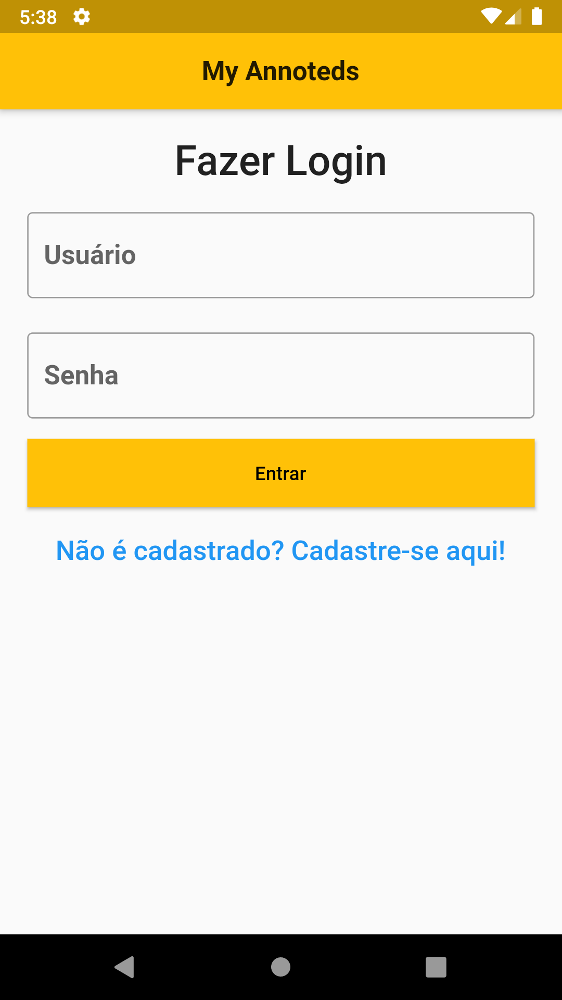
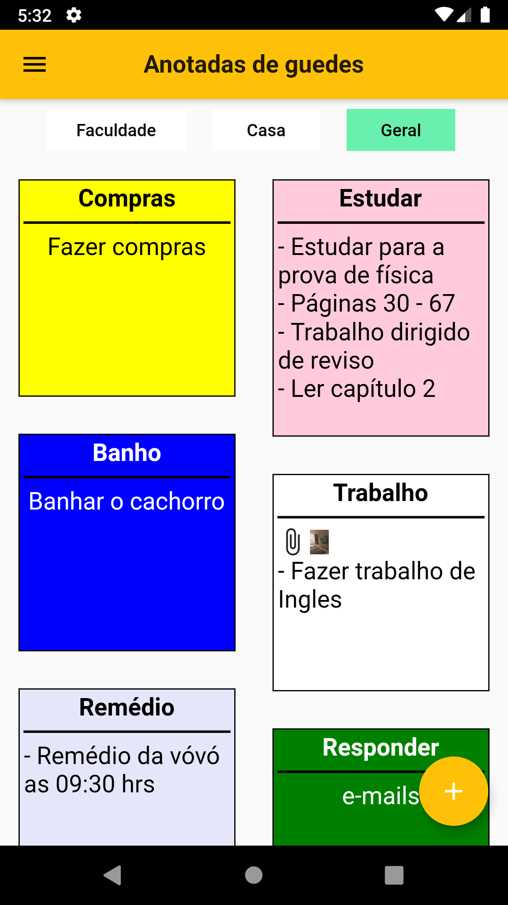
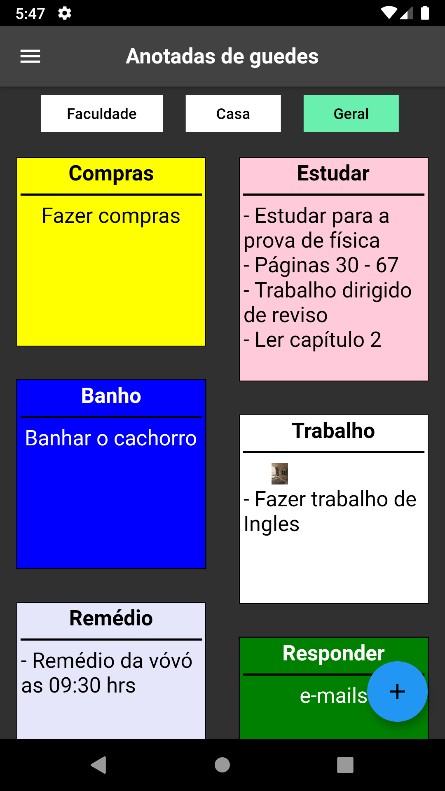
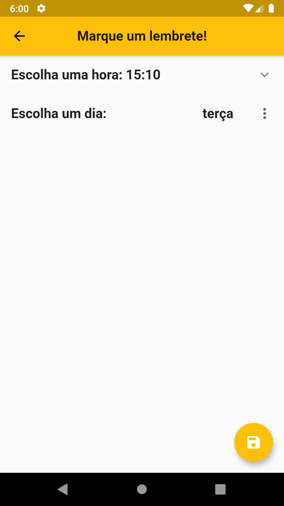
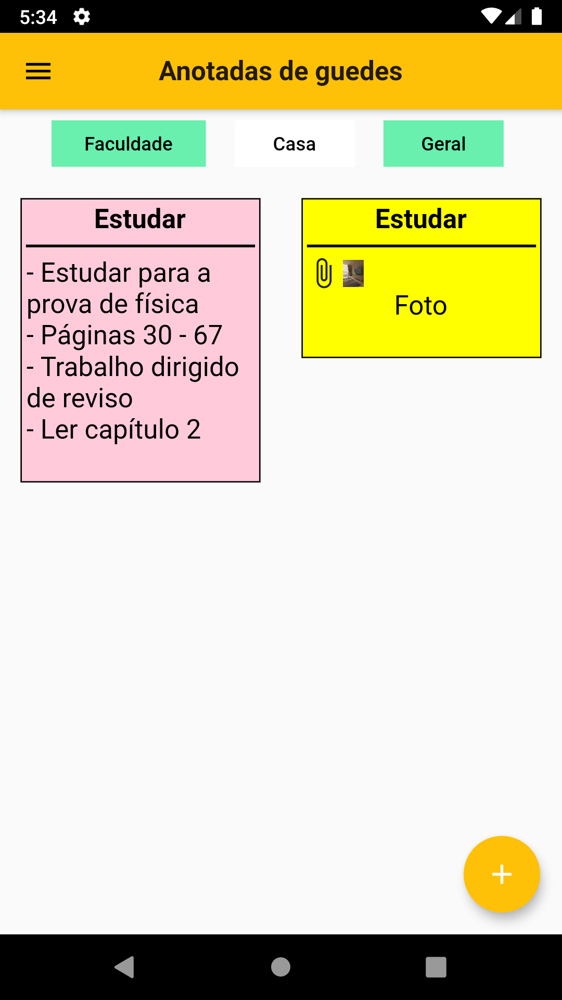
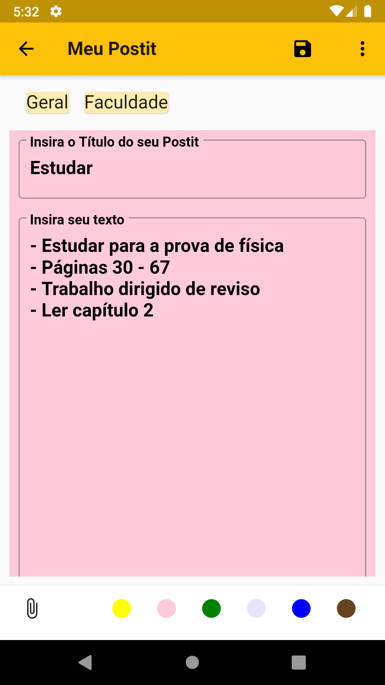
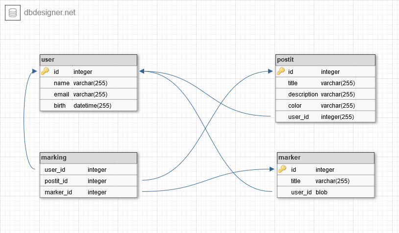

# My_Annoteds
Projeto de lembretes de anotações (Postits) semelhante ao Google Keep.

## Features
  - Cadastrar vários perfis de usuário
  - Criar/Editar os seus postits (tocando em um postit), bem como adicionar uma imagem
  - Remover um postit (arrastanto o mesmo para o lado esquerdo ou direito)
  - Marcar um lembrete de um postit (segurando 2 segundos o toque no postit)
  - Gerenciar os seus marcadores (Tags)
  - Filtrar seus postits por um ou mais marcadores
  - Personalizar configurações de preferência de temas (Sistema, Light, Dark, Alto-Contraste) e tamanho da fonte

## Observação
Para que as notificações funcionem, seu celular deve estar configurado no horário de Brasília/São Paulo.

## Screenshots

      
      

## Modelo Relacional
Modelo relacional utilizado para o Banco de Dados (SQLite).

## Desenvolvimento
Projeto desenvolvido para aprendizado no projeto Dell Academy: Mentoria Flutter

1. Autores
  - Antônio Honorato Moreira Guedes
  - Elias Cícero Moreira Guedes

2. Mentor
  - Israel Barbosa

