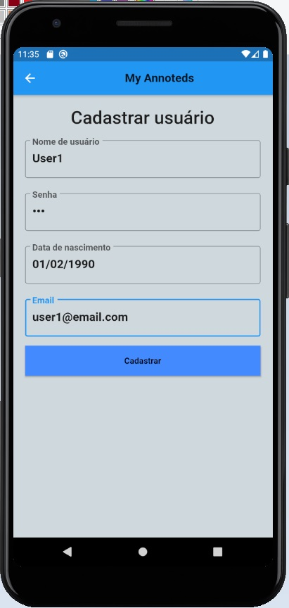
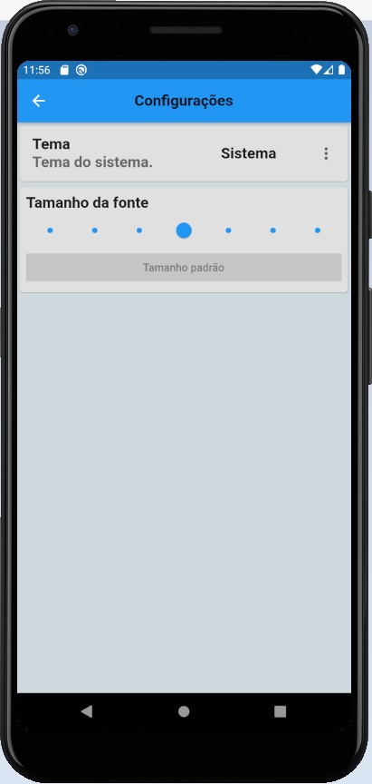
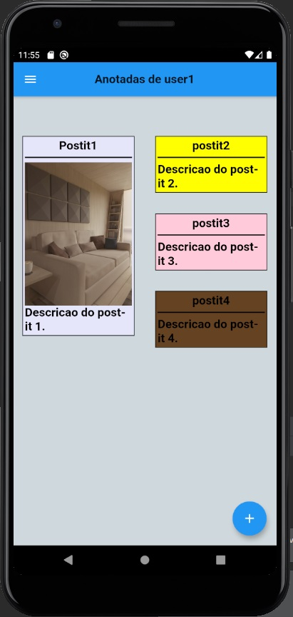
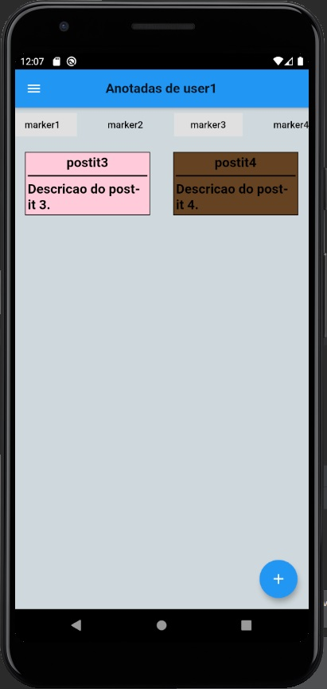
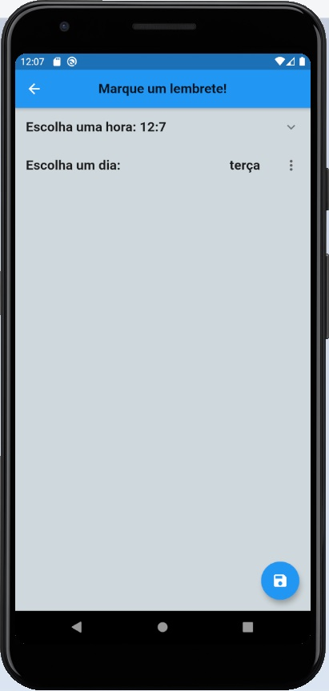

# my_anoteds
Projeto de cards de anotações rápidas (postits) semelhante ao Google Keep.

## Features
1.Na tela de login, o usuário pode realizar seu cadastro ou logar no sistema.

2.Após realizar o login no sistema, o usuário acessa sua Home page, onde poderá:
    i.No botão inferior: cadastrar seus postits,
    ii.No menu lateral: gerenciar os seus marcadores(Tags), personalizar configurações e realizar o Logout,
    iii.Na parte superior: filtrar suas notas por marcador
  
3.Além disso, na Home page o usuário poderá:
    i.Ler/Editar um postit: tocando em um postit,
    ii.Marcar um lembrete de um postit: segurando 2 segundos o toque no postit,
    iii.Remover um postit: arrastanto o mesmo para o lado esquerdo ou direito,
  
4.Na tela de cadastro de postits, o usuário poderá:
    i.Inserir título, corpo, cor e também anexar uma imagem
    ii.Associar seu postit com os seus marcadores cadastrados.
  
## Observação
Para que as notificações funcionem, seu celular deve estar com o local configurado para Brasília/São Paulo.
Caso não esteja, configure seu smartphone:

1. Vá em Settings -> System -> Date & Time -> Time Zone
2. Selecione em "Region": Brazil; "Time Zone": Sao Paulo.

## Screenshots

 
 
